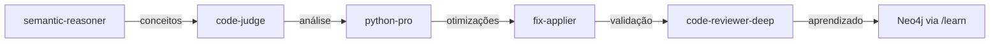

# Python Optimize - Otimização Completa Python com Sinergia

Otimiza código Python através da orquestração inteligente de múltiplos agentes: semantic-reasoner, code-judge, python-pro e fix-applier.

## Fluxo de Trabalho com Sinergia

### 1. Buscar Contexto e Análise Semântica
```python
# FASE 1: Semantic-Reasoner analisa conceitos
semantic_context = Task(
    "semantic-reasoner",
    "Analyze Python code for conceptual issues, architectural flaws, and optimization opportunities",
    file_path
)

# FASE 2: Buscar contexto histórico no Neo4j
historical_context = "/context python optimization {file_path}"
```

### 2. Orquestração com Code-Judge
```python
# Code-Judge coordena análise especializada
judge_result = Task(
    "code-judge",
    "Complete Python analysis with all sub-agents",
    semantic_hints=semantic_context
)

# Sub-agentes ativados:
# - code-judge-performance: Complexidade e bottlenecks
# - code-judge-patterns: Design patterns Python
# - code-judge-quality: PEP 8 e idiomas Python
```

### 3. Python-Pro para Otimização Específica

**Ativação automática do python-pro para:**
- Refatoração pythônica profunda
- Implementação de generators e async/await
- Decorators e metaclasses avançadas
- Otimização de memória com __slots__

### 4. Profiling Detalhado com Análise Inteligente
```python
import cProfile
import pstats
import memory_profiler

# Profile do código atual
profiler = cProfile.Profile()
profiler.enable()
# [código a ser analisado]
profiler.disable()

stats = pstats.Stats(profiler)
stats.sort_stats('cumulative')
stats.print_stats(10)
```

### 5. Aplicar Otimizações com Fix-Applier

```python
# Fix-Applier com validação semântica
fixes = Task(
    "fix-applier",
    "Apply Python optimizations with semantic validation",
    fixes=[
        "Convert lists to generators",
        "Add @lru_cache decorators",
        "Implement async/await",
        "Add type hints",
        "Use __slots__ for memory"
    ],
    confidence_threshold=0.90
)
```

**Otimizações aplicadas automaticamente:**
- **Generators vs Lists**: Para iterables > 1000 items
- **Comprehensions**: Loops simples convertidos
- **@lru_cache**: Em funções recursivas/repetitivas
- **Async/Await**: I/O operations convertidas
- **Type Hints**: Adicionados para mypyc

### 6. Validação com Code-Reviewer-Deep

```bash
# Rodar testes
pytest -v --cov=. --cov-report=term-missing

# Benchmark antes/depois
python3 -m timeit -s "from module import function" "function()"

# Verificar memória
python3 -m memory_profiler script.py
```

### 7. Salvar Aprendizado no Neo4j

```python
# Comando /learn salva otimizações bem-sucedidas
"/learn Python optimization: {improvements} - Performance gain: {percentage}%"
```

## Sinergia Completa entre Agentes

### Fluxo de Comunicação:


### Gatilhos Automáticos de Sinergia:

Este comando ativa automaticamente:
- **semantic-reasoner**: Para análise conceitual Python
- **code-judge-performance**: Complexidade > 10
- **code-judge-patterns**: Classes > 200 linhas
- **python-pro**: Refatoração pythônica
- **fix-applier**: Aplicação com 90% confiança
- **code-reviewer-deep**: Validação final
- **/learn**: Salvar padrões de sucesso

## Exemplo de Uso com Sinergia

```bash
/python-optimize mcp_server.py

# Fluxo automático:
# 1. semantic-reasoner → Análise conceitual
# 2. /context → Busca otimizações similares no Neo4j
# 3. code-judge → Orquestra 5 sub-agentes
# 4. python-pro → Refatoração pythônica
# 5. fix-applier → Aplica com 90% confiança
# 6. code-reviewer-deep → Valida mudanças
# 7. /learn → Salva sucesso no Neo4j
```

## Resultado Esperado com Sinergia

```json
{
  "analysis": {
    "semantic_issues": 3,
    "performance_bottlenecks": 5,
    "pattern_violations": 2
  },
  "optimizations_applied": {
    "generators_implemented": 4,
    "async_conversions": 3,
    "cache_decorators": 6,
    "type_hints_added": 45,
    "__slots___added": 2
  },
  "performance_gains": {
    "speed": "+47%",
    "memory": "-32%",
    "complexity": "-25%"
  },
  "validation": {
    "tests_passing": "100%",
    "coverage": "94%",
    "type_checking": "clean"
  },
  "learned": "Saved to Neo4j for future optimizations"
}
```

## Checklist Atualizado com Sinergia

- [ ] Semantic-reasoner analisou conceitos
- [ ] Code-judge orquestrou sub-agentes
- [ ] Python-pro refatorou pythonicamente
- [ ] Fix-applier aplicou com alta confiança
- [ ] Code-reviewer-deep validou
- [ ] Performance melhorada em > 30%
- [ ] Aprendizado salvo no Neo4j
- [ ] Documentação auto-gerada