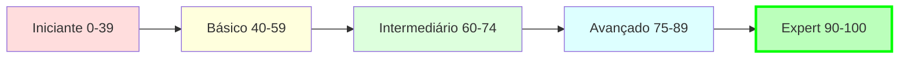

# CLAUDE.md - Claude Code SDK Bootcamp System

## 🎯 Projeto: Bootcamp Claude Code SDK
**Criador:** Diego Fornalha (diegofornalha@gmail.com)
**Meta:** Elevar desenvolvedores de Score 0 → 100 em Claude Code SDK
**Duração:** 12 semanas com acompanhamento personalizado

## 🤖 Sistema Multi-Agente Especializado

### Agentes Claude Code SDK
- **claude-sdk-expert**: Mentor absoluto em SDK - conhece cada linha do código fonte
- **ai-mentor**: Transformador de desenvolvedores Python em experts do SDK
- **cto**: Diretor Técnico especializado em arquitetura Claude e avaliação de talentos SDK
- **recrutador-claude-sdk**: Identificador de talentos e gaps de conhecimento em SDK

### Agentes de Suporte
- **chief-of-staff**: Orquestrador executivo para coordenação geral
- **translator-pro**: Tradutor inteligente para documentação PT-BR

## 📚 Estrutura do Bootcamp

### Fase 1: Fundamentos (Semanas 1-3) - Score 45→60
```python
# Conceitos Core
- query() para consultas stateless
- ClaudeCodeOptions (temperature, allowed_tools, system_prompt)
- Async/await patterns
- Autenticação via claude login (NUNCA API keys!)
```

### Fase 2: Ferramentas (Semanas 4-6) - Score 60→70
```python
# Ferramentas Nativas
- File: Read, Write, Edit, MultiEdit
- Search: Grep, Glob, WebSearch, WebFetch
- System: Bash, Execute, TodoWrite
```

### Fase 3: Gaps Críticos (Semanas 7-10) - Score 70→85
```python
# Gap #1: MCP Tools
@tool(name="calc", description="Calculadora", input_schema={...})
async def calc_tool(args: Dict) -> Dict:
    return {"content": [{"type": "text", "text": "resultado"}]}

# Gap #2: Hooks System
HookMatcher(matcher="PreToolUse", hooks=[validar])
# None = permite, {"behavior": "deny"} = bloqueia
```

### Fase 4: Advanced (Semanas 11-12) - Score 85→100
```python
# Features Avançadas
- ClaudeSDKClient para sessões stateful
- Streaming com receive_response()
- Multi-agent orchestration com Task tool
```

## 📁 Estrutura de Arquivos

### Exercícios Práticos
```bash
claude-code-sdk-python/examples/
├── 01_hello_claude.py                    # ✅ Completo
├── exercicios_praticos_pt_br.py         # 7 exercícios progressivos
├── gap_1_mcp_tools_tutorial.py          # Tutorial MCP Tools
├── gap_2_hooks_tutorial.py              # Tutorial Hooks
├── quiz_claude_sdk.py                   # Quiz interativo
└── 02_query_vs_client.py               # Comparação stateless vs stateful
```

### Diagramas de Arquitetura
```bash
diagram/
├── 01_core_modules.md                   # Estrutura do SDK
├── 02_learning_path.md                  # Jornada de 12 semanas
├── 03_architecture.md                   # Arquitetura completa
├── 04_neo4j_tracking.md                # Sistema de tracking
└── sdk_coverage_report.md              # 81.25% de cobertura
```

### Documentação Diego
```bash
diegofornalha/
└── 01_hello_claude_explicado.md        # Análise linha por linha
```

## 🛠️ Comandos Slash Disponíveis

### Comandos de Aprendizado SDK
```bash
/start-ai-bootcamp          # Iniciar bootcamp personalizado
/sdk-basics                 # Fundamentos do Claude Code SDK
/sdk-help                   # Ajuda detalhada sobre SDK
/sdk-quiz                   # Quiz interativo de conhecimento
/daily-progress            # Check-in diário de progresso
/week-project              # Projeto semanal do bootcamp
```

### Comandos de Avaliação
```bash
/ai-basics                  # Conceitos básicos de IA com Claude
/ai-transition-hiring      # Processo de contratação para SDK
/claude-sdk-expert-workflow # Workflow completo de expertise
```

## 🎮 Scripts de Avaliação

### Scripts SDK (.claude/hooks/scripts/)
```python
claude_sdk_evaluator.py     # Avaliador de proficiência SDK
sdk_interview_tech.py       # Entrevista técnica SDK
sdk_practical_tests.py      # Testes práticos de código
```

### Hooks Automatizados (.claude/hooks/)
```python
bootcamp-tracker.py         # Rastreamento automático de progresso
sdk-auto-helper.py         # Helper automático para dúvidas SDK
```

## 📊 Sistema de Tracking (Neo4j)

### Labels Principais
- **Learning**: Conceitos aprendidos
- **Exercise**: Exercícios completados
- **QuizResult**: Resultados de quizzes
- **PlayerBootcampGap**: Gaps identificados

### Queries Úteis
```cypher
// Ver progresso do Diego
MATCH (p:Learning {name: "Diego Fornalha"})
RETURN p.score, p.gaps, p.exercises_completed

// Buscar gaps críticos
MATCH (g:PlayerBootcampGap)
WHERE g.gap IN ["MCP Tools", "Hooks System"]
RETURN g
```

## 🚀 Quick Start para Novos Desenvolvedores

### 1. Verificar Score Inicial
```bash
python examples/quiz_claude_sdk.py --rapido
```

### 2. Começar com Hello World
```bash
python examples/01_hello_claude.py
```

### 3. Seguir Exercícios
```bash
python examples/exercicios_praticos_pt_br.py 1
```

### 4. Resolver Gaps
```bash
# Se gap em MCP Tools
python examples/gap_1_mcp_tools_tutorial.py

# Se gap em Hooks
python examples/gap_2_hooks_tutorial.py
```

### 5. Validar Aprendizado
```bash
python examples/quiz_claude_sdk.py --completo
```

## 🎯 Métricas de Sucesso

### KPIs do Bootcamp
- **Taxa de Conclusão**: Meta > 80%
- **Score Final**: Meta >= 95/100
- **Tempo Médio**: 8-12 semanas
- **Aplicação Prática**: 100% usando SDK em projetos reais

### Status Atual - Diego Fornalha
```yaml
Score: 45/100
Semana: 1/12
Gaps: ["MCP Tools", "Hooks System"]
Próximo: Exercício 1 - query() básico
Meta: Score 100 em 12 semanas
```

## ⚡ Regras Críticas

### SEMPRE
- ✅ Use `query()` para consultas simples stateless
- ✅ Use `ClaudeSDKClient` para conversas com contexto
- ✅ Autentique com `claude login`
- ✅ Retorne `{"content": [...]}` em MCP tools
- ✅ Use `async/await` em todo código SDK

### NUNCA
- ❌ Use ANTHROPIC_API_KEY (eliminatório!)
- ❌ Crie APIs REST para MCP tools (são locais!)
- ❌ Ignore hooks em produção
- ❌ Use sync quando async está disponível
- ❌ Pule os gaps críticos (MCP e Hooks)

## 📈 Evolução de Proficiência



## 🔗 Recursos Essenciais

### Documentação
- [Claude Code SDK Python](https://github.com/diegofornalha/claude-code-sdk-python)
- Branch: `feature/portuguese-translations`
- Criador: Diego Fornalha

### Arquivos Core do SDK
```python
/src/claude_code_sdk/
├── query.py           # Função principal stateless
├── client.py          # Cliente stateful
├── types.py           # ClaudeCodeOptions
└── _errors.py         # Tratamento de erros
```

## 💡 Filosofia do Bootcamp

> "O melhor desenvolvedor Claude Code SDK não é quem conhece mais features, mas quem sabe QUANDO usar cada uma."

- **Query** para simplicidade
- **Client** para contexto
- **MCP** para extensibilidade
- **Hooks** para controle
- **Async** sempre!

---

*Sistema criado por Diego Fornalha*
*Email: diegofornalha@gmail.com*
*Meta: Transformar qualquer desenvolvedor Python em expert Claude Code SDK*