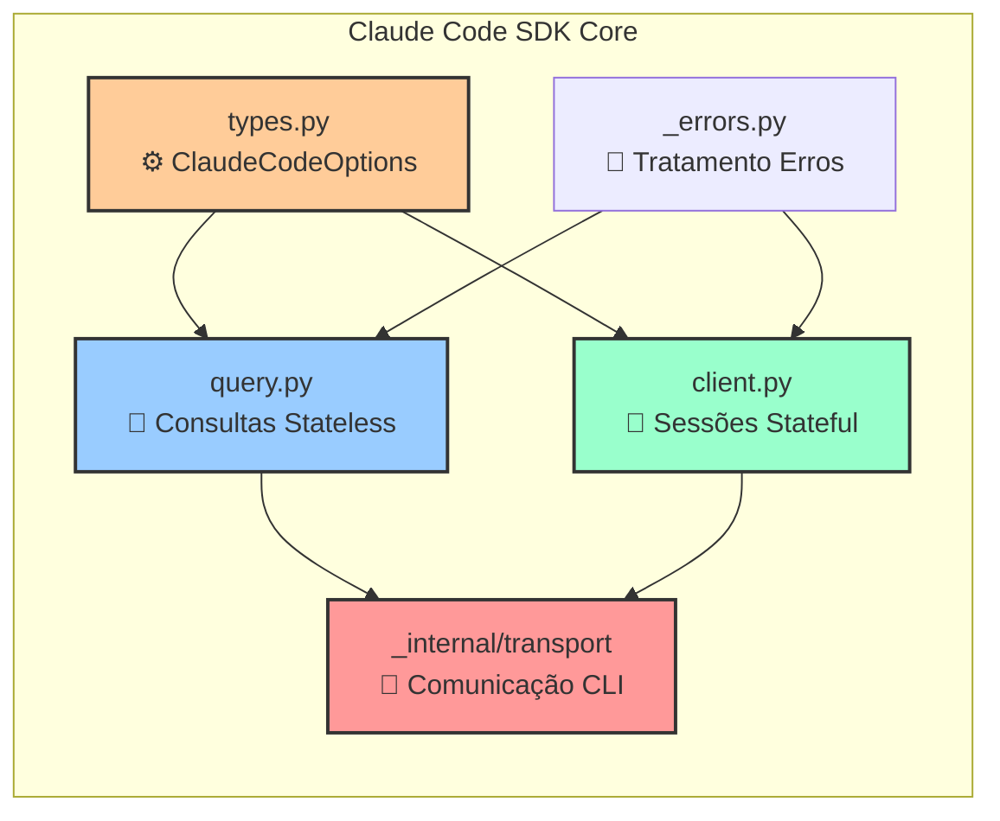
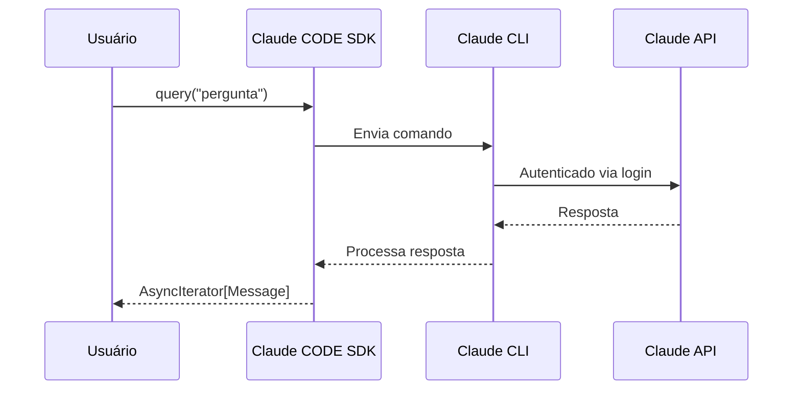

# 📦 Core Modules - Estrutura Principal do SDK

## Visão Geral
Os módulos principais do Claude Code SDK que formam a base de toda interação.

## Diagrama de Arquitetura



## Detalhamento dos Módulos

### 📝 query.py - Consultas Stateless
```python
from claude_code_sdk import query

# Consultas simples sem manter contexto
async for msg in query("pergunta"):
    print(msg)
```
- **Uso:** Tarefas isoladas, one-shot
- **Memória:** Não mantém contexto
- **Performance:** Mais rápido para tarefas simples

### 💬 client.py - Sessões Stateful
```python
from claude_code_sdk import ClaudeSDKClient

# Mantém contexto entre mensagens
client = ClaudeSDKClient()
await client.send_message("primeira mensagem")
# Cliente lembra da conversa anterior
```
- **Uso:** Conversas multi-turno
- **Memória:** Mantém histórico completo
- **Performance:** Ideal para interações longas

### ⚙️ types.py - ClaudeCodeOptions
```python
from claude_code_sdk import ClaudeCodeOptions

options = ClaudeCodeOptions(
    temperature=0.7,
    allowed_tools=["Read", "Write"],
    system_prompt="Você é um expert"
)
```
- **temperature:** Criatividade (0-1)
- **allowed_tools:** Ferramentas permitidas
- **system_prompt:** Personalização do comportamento

### 🚨 _errors.py - Tratamento de Erros
```python
from claude_code_sdk._errors import (
    ClaudeSDKError,
    AuthenticationError,
    ToolExecutionError
)
```
- Hierarquia completa de exceções
- Mensagens de erro descritivas
- Recovery strategies

### 🔌 _internal/transport - Comunicação CLI
- Interface com Claude CLI
- Gerencia autenticação via `claude login`
- Protocolo de comunicação assíncrono
- Sem necessidade de API key

## Fluxo de Execução



## Status Atual
- ✅ Todos os módulos core implementados
- ✅ Documentação em português disponível
- ✅ Exemplos práticos criados
- 🔄 Branch: feature/portuguese-translations