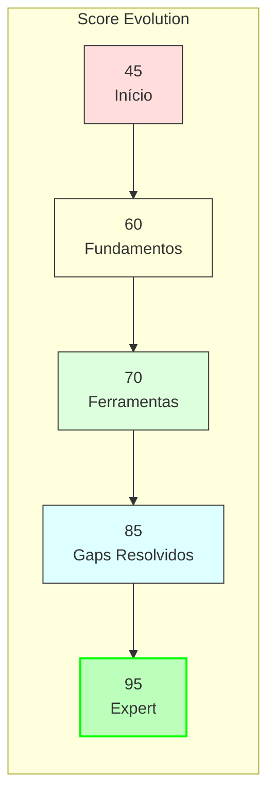

# 🎯 Learning Path - Jornada Diego Fornalha

## Cronograma Detalhado

### 📅 Fase 1: Fundamentos (Score: 45 → 60)
| Semana | Foco | Exercício | Status |
|--------|------|-----------|--------|
| 1 | Hello World | `01_hello_claude.py` | ✅ |
| 2 | query() | Exercício 1 | 🔄 |
| 3 | Options | Exercício 2 | ⏳ |

### 🛠️ Fase 2: Ferramentas (Score: 60 → 70)
| Semana | Foco | Exercício | Status |
|--------|------|-----------|--------|
| 4 | Read/Write | Exercício 3 (parte 1) | ⏳ |
| 5 | Grep/Bash | Exercício 3 (parte 2) | ⏳ |
| 6 | WebSearch | Exercício 3 (parte 3) | ⏳ |

### 🔴 Fase 3: Gaps Críticos (Score: 70 → 85)
| Semana | Foco | Exercício | Status |
|--------|------|-----------|--------|
| 7-8 | **MCP Tools** | Exercício 4 + Tutorial | 🔴 |
| 9-10 | **Hooks System** | Exercício 5 + Tutorial | 🔴 |

### 🚀 Fase 4: Expert (Score: 85 → 95)
| Semana | Foco | Exercício | Status |
|--------|------|-----------|--------|
| 11 | Streaming/Client | Exercício 6 | ⏳ |
| 12 | Multi-Agent | Exercício 7 + Projeto | ⏳ |

## Recursos de Apoio

### 📚 Tutoriais Criados
```bash
# Para Gap 1 - MCP Tools
python examples/gap_1_mcp_tools_tutorial.py

# Para Gap 2 - Hooks System
python examples/gap_2_hooks_tutorial.py
```

### 📊 Quiz de Validação
```bash
# Quiz completo
python examples/quiz_claude_sdk.py --completo

# Quiz focado em gaps
python examples/quiz_claude_sdk.py --gaps

# Review de progresso
python examples/quiz_claude_sdk.py --review
```

### 🎮 Comandos Slash
```bash
/sdk-basics          # Fundamentos
/daily-progress      # Check-in diário
/sdk-quiz           # Quiz interativo
/week-project       # Projeto semanal
```

## Métricas de Progresso



## Status Atual: Semana 1
- 📍 **Localização:** Fase 1 - Fundamentos
- 📊 **Score:** 45/100
- 🎯 **Próximo:** Exercício 1 (query básica)
- 🔴 **Gaps:** MCP Tools, Hooks System
- ⏰ **Tempo Restante:** 11 semanas