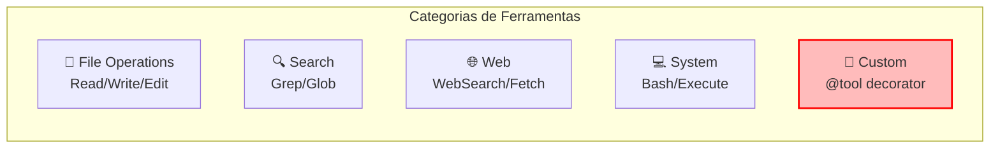
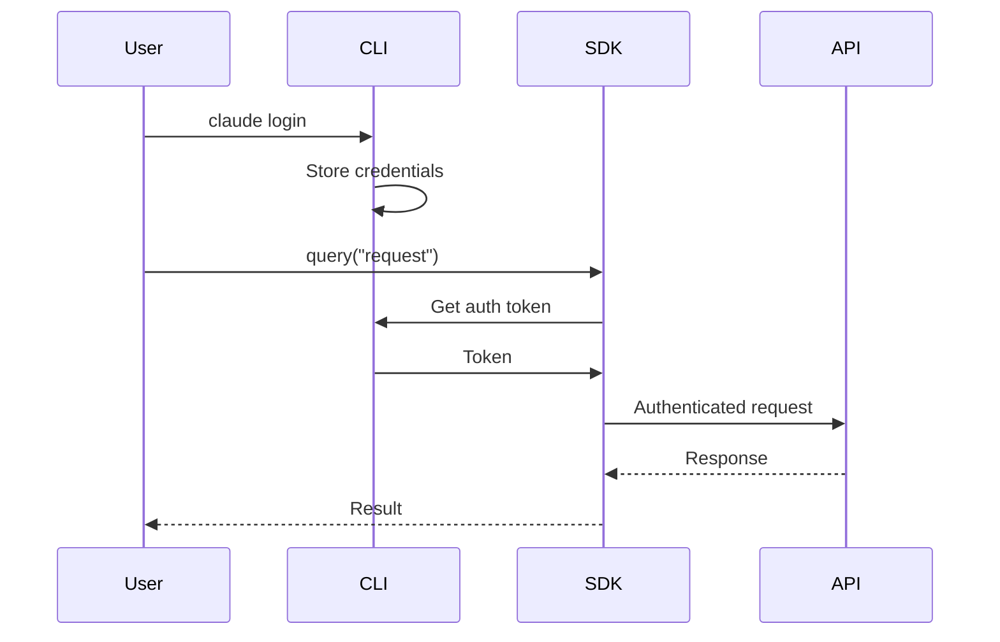
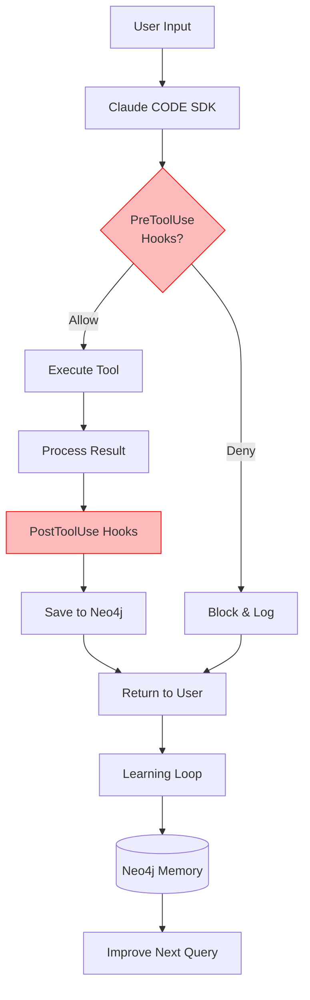
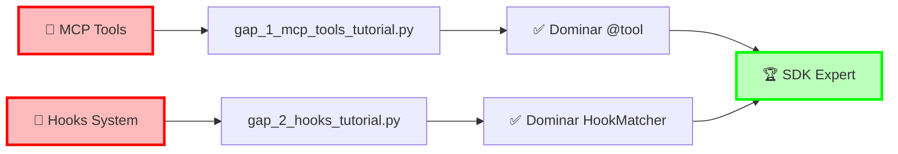

# 🏗️ Arquitetura Geral - Claude Code SDK Bootcamp

## Visão Macro do Sistema

```mermaid
graph TB
    subgraph "Frontend Layer"
        Dev[👨‍💻 Desenvolvedor]
        CLI[Claude CLI]
        VSCode[VS Code Extension]
    end

    subgraph "SDK Layer"
        SDK[Claude Code SDK]
        Query[query()]
        Client[ClaudeSDKClient]
        Options[ClaudeCodeOptions]
    end

    subgraph "Tools Layer"
        BasicTools[Basic Tools<br/>Read/Write/Edit]
        SearchTools[Search Tools<br/>Grep/Glob/WebSearch]
        SystemTools[System Tools<br/>Bash/Execute]
        CustomTools[Custom Tools<br/>MCP Tools]
    end

    subgraph "Hooks Layer"
        PreHooks[PreToolUse Hooks]
        PostHooks[PostToolUse Hooks]
        Security[Security Validation]
        Logging[Activity Logging]
    end

    subgraph "Backend Layer"
        Transport[Transport Protocol]
        Auth[Authentication<br/>claude login]
        API[Claude API]
    end

    subgraph "Data Layer"
        Neo4j[Neo4j Memory]
        LocalCache[Local Cache]
        Logs[Audit Logs]
    end

    Dev --> CLI
    Dev --> VSCode
    CLI --> SDK
    VSCode --> SDK

    SDK --> Query
    SDK --> Client
    SDK --> Options

    Query --> BasicTools
    Client --> SearchTools
    Options --> SystemTools
    Options --> CustomTools

    BasicTools --> PreHooks
    SearchTools --> PreHooks
    SystemTools --> PreHooks
    CustomTools --> PreHooks

    PreHooks --> Security
    Security --> Transport
    Transport --> Auth
    Auth --> API

    API --> PostHooks
    PostHooks --> Logging
    Logging --> Neo4j
    Logging --> Logs

    Transport --> LocalCache

    style SDK fill:#f9f,stroke:#333,stroke-width:3px
    style CustomTools fill:#fbb,stroke:#f00,stroke-width:2px
    style PreHooks fill:#fbb,stroke:#f00,stroke-width:2px
```

## Componentes Detalhados

### 🎯 Frontend Layer
```yaml
Desenvolvedor:
  - Interage via CLI ou VS Code
  - Executa scripts Python
  - Usa comandos slash

Claude CLI:
  - Interface primária
  - Gerencia autenticação
  - Processa comandos

VS Code Extension:
  - IDE integration
  - IntelliSense support
  - Debug capabilities
```

### 📦 SDK Layer
```python
# Componentes principais
from claude_code_sdk import (
    query,              # Stateless
    ClaudeSDKClient,   # Stateful
    ClaudeCodeOptions, # Config
    tool,              # MCP decorator
    HookMatcher        # Hooks
)
```

### 🛠️ Tools Layer


### 🎣 Hooks Layer
```python
# Sistema de interceptação
hooks = [
    HookMatcher(
        matcher="PreToolUse",
        hooks=[validate, rate_limit, log]
    ),
    HookMatcher(
        matcher="PostToolUse",
        hooks=[process, save]
    )
]
```

### 🔒 Security & Auth


### 💾 Data Layer
```yaml
Neo4j Memory:
  - Grafo de conhecimento
  - Tracking de progresso
  - Aprendizados salvos

Local Cache:
  - Respostas recentes
  - Configurações
  - Histórico de quiz

Audit Logs:
  - Todas as operações
  - Métricas de uso
  - Debugging info
```

## Fluxo de Execução Completo



## Stack Tecnológico

| Camada | Tecnologia | Propósito |
|--------|------------|-----------|
| Frontend | Python 3.8+ | Runtime principal |
| SDK | Claude Code SDK | Interface com Claude |
| Auth | Claude CLI | Autenticação segura |
| Tools | MCP Protocol | Ferramentas customizadas |
| Hooks | Event System | Interceptação e validação |
| Memory | Neo4j | Persistência de conhecimento |
| Cache | JSON/SQLite | Performance optimization |

## Pontos Críticos (Gaps do Diego)



## Ambiente de Desenvolvimento

```bash
# Estrutura do projeto
claude-code-sdk-python/
├── src/
│   └── claude_code_sdk/     # Core SDK
├── examples/
│   ├── *.py                 # Exemplos práticos
│   └── *_pt_br.py           # Traduções PT-BR
├── .claude/
│   ├── agents/              # Subagentes
│   ├── commands/            # Comandos slash
│   └── hooks/               # Automação
└── diagram/
    ├── 01_core_modules.md   # Este arquivo
    ├── 02_learning_path.md  # Jornada
    └── 03_architecture.md   # Arquitetura
```