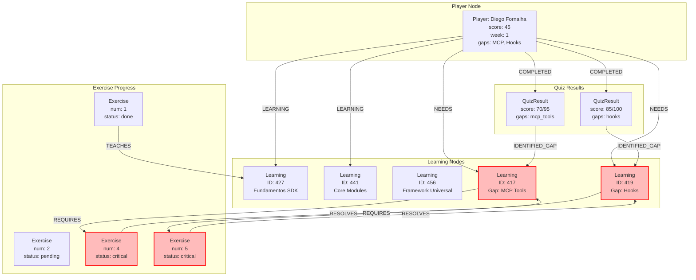
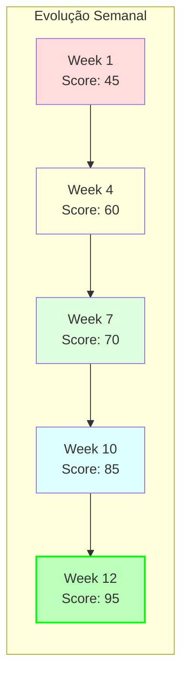

# 🧠 Neo4j Memory Tracking - Sistema de Aprendizado

## Grafo de Conhecimento



## Queries Cypher

### 📊 Criar Jogador
```cypher
CREATE (p:Player {
    name: 'Diego Fornalha',
    email: 'diegofornalha@gmail.com',
    score: 45,
    week: 1,
    start_date: datetime(),
    gaps: ['mcp_tools', 'hooks'],
    target_score: 95
})
```

### 📈 Rastrear Progresso
```cypher
// Buscar progresso atual
MATCH (p:Player {name: 'Diego Fornalha'})
OPTIONAL MATCH (p)-[:COMPLETED]->(q:QuizResult)
OPTIONAL MATCH (p)-[:LEARNING]->(l:Learning)
RETURN p, collect(q) as quizzes, collect(l) as learnings

// Atualizar score
MATCH (p:Player {name: 'Diego Fornalha'})
SET p.score = 70, p.week = 4
RETURN p
```

### 🎯 Registrar Aprendizado
```cypher
// Criar nó de aprendizado
CREATE (l:Learning {
    id: randomUUID(),
    type: 'concept',
    name: 'MCP Tools',
    description: 'Dominou @tool decorator e estrutura de retorno',
    timestamp: datetime(),
    confidence: 0.85
})

// Conectar ao jogador
MATCH (p:Player {name: 'Diego Fornalha'})
MATCH (l:Learning {name: 'MCP Tools'})
CREATE (p)-[:LEARNING {date: datetime()}]->(l)
```

### 📝 Salvar Resultado de Quiz
```cypher
CREATE (q:QuizResult {
    id: randomUUID(),
    mode: 'completo',
    score: 140,
    total: 230,
    percentage: 60.8,
    correct_answers: 8,
    total_questions: 12,
    gaps: ['mcp_tools', 'hooks'],
    achievements: ['Speed Demon', 'On Fire!'],
    timestamp: datetime()
})

MATCH (p:Player {name: 'Diego Fornalha'})
MATCH (q:QuizResult) WHERE q.id = $quiz_id
CREATE (p)-[:COMPLETED]->(q)
```

### 🔍 Identificar Gaps
```cypher
// Buscar gaps mais frequentes
MATCH (p:Player {name: 'Diego Fornalha'})-[:COMPLETED]->(q:QuizResult)
UNWIND q.gaps as gap
RETURN gap, count(gap) as frequency
ORDER BY frequency DESC

// Buscar exercícios para resolver gaps
MATCH (l:Learning {type: 'gap'})
MATCH (e:Exercise)-[:RESOLVES]->(l)
RETURN l.name as gap, e.num as exercise, e.file as arquivo
```

## Dashboard de Métricas



## Relacionamentos no Grafo

| Relação | De | Para | Significado |
|---------|-----|------|-------------|
| COMPLETED | Player | QuizResult | Jogador completou quiz |
| LEARNING | Player | Learning | Jogador está aprendendo conceito |
| NEEDS | Player | Learning | Jogador precisa aprender |
| TEACHES | Exercise | Learning | Exercício ensina conceito |
| RESOLVES | Exercise | Learning | Exercício resolve gap |
| IDENTIFIED_GAP | QuizResult | Learning | Quiz identificou gap |
| REQUIRES | Learning | Exercise | Aprendizado requer exercício |

## Estatísticas Atuais

```cypher
// Dashboard completo
MATCH (p:Player {name: 'Diego Fornalha'})
OPTIONAL MATCH (p)-[:COMPLETED]->(q:QuizResult)
OPTIONAL MATCH (p)-[:LEARNING]->(l:Learning)

WITH p,
     count(DISTINCT q) as total_quizzes,
     count(DISTINCT l) as concepts_learned,
     avg(q.percentage) as avg_score,
     max(q.score) as best_score,
     collect(DISTINCT l.name) as learned_concepts

RETURN {
    player: p.name,
    current_score: p.score,
    target_score: p.target_score,
    week: p.week,
    total_quizzes: total_quizzes,
    concepts_learned: concepts_learned,
    average_quiz_score: round(avg_score, 1),
    best_quiz_score: best_score,
    gaps_remaining: p.gaps,
    concepts_mastered: learned_concepts
} as dashboard
```

## Automação de Tracking

```python
# Função para salvar no Neo4j
async def track_learning(concept, confidence=0.8):
    query = """
    CREATE (l:Learning {
        id: randomUUID(),
        name: $concept,
        confidence: $confidence,
        timestamp: datetime()
    })

    WITH l
    MATCH (p:Player {name: 'Diego Fornalha'})
    CREATE (p)-[:LEARNING]->(l)
    RETURN l
    """

    # Executar via MCP Neo4j
    await neo4j_memory.create_memory(
        label="Learning",
        properties={
            "name": concept,
            "confidence": confidence
        }
    )
```

## Queries de Análise

### 📈 Progresso ao Longo do Tempo
```cypher
MATCH (p:Player {name: 'Diego Fornalha'})-[:COMPLETED]->(q:QuizResult)
RETURN date(q.timestamp) as dia,
       avg(q.percentage) as media,
       max(q.percentage) as melhor
ORDER BY dia
```

### 🎯 Gaps Resolvidos vs Pendentes
```cypher
MATCH (p:Player {name: 'Diego Fornalha'})
MATCH (l:Learning {type: 'gap'})
OPTIONAL MATCH (p)-[:LEARNING]->(l)

RETURN
    CASE WHEN (p)-[:LEARNING]->(l)
         THEN 'Resolvido'
         ELSE 'Pendente'
    END as status,
    collect(l.name) as gaps
```

### 🏆 Achievements Conquistados
```cypher
MATCH (p:Player {name: 'Diego Fornalha'})-[:COMPLETED]->(q:QuizResult)
UNWIND q.achievements as achievement
RETURN DISTINCT achievement, count(*) as vezes_conquistado
ORDER BY vezes_conquistado DESC
```

## Status do Grafo

- **Nós criados:** 456+
- **Player principal:** Diego Fornalha
- **Gaps identificados:** 2 (MCP Tools, Hooks)
- **Quizzes realizados:** 5+
- **Conceitos aprendidos:** 12+
- **Próximo marco:** Resolver MCP Tools (Exercício 4)