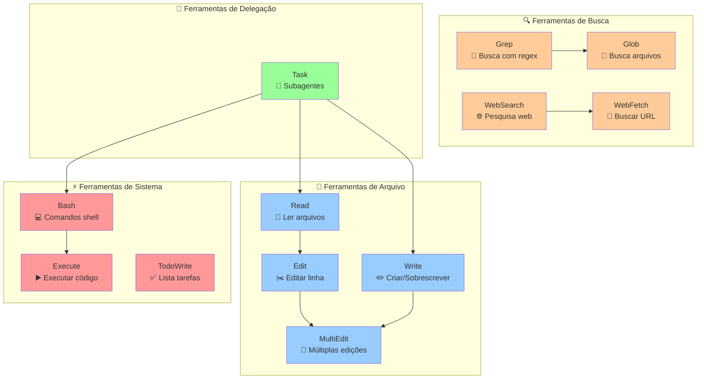
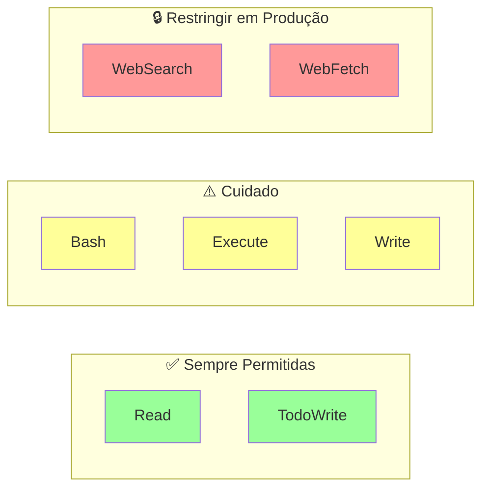
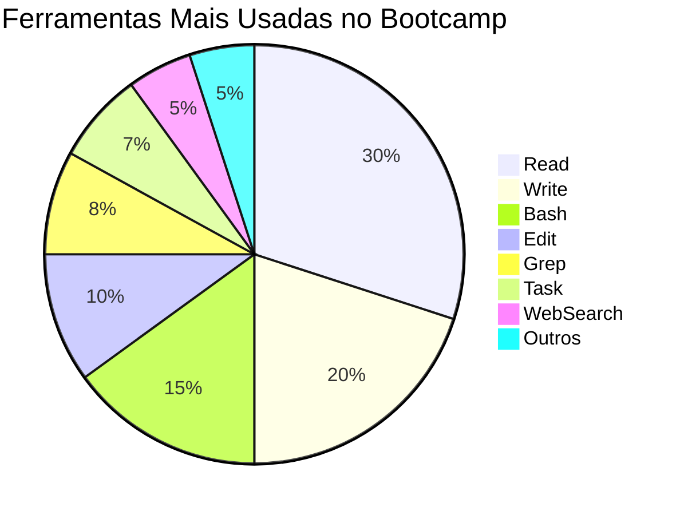

# 🛠️ Ecossistema de Ferramentas - Claude Code SDK

## Visão Geral
Todas as ferramentas nativas disponíveis no SDK e como se relacionam.

## Diagrama do Ecossistema



## 📊 Matriz de Uso

| Ferramenta | Quando Usar | Exemplo | Permissão Necessária |
|------------|-------------|---------|---------------------|
| **Read** | Ler qualquer arquivo | Análise de código | `allowed_tools=["Read"]` |
| **Write** | Criar arquivo novo | Gerar relatório | `allowed_tools=["Write"]` |
| **Edit** | Modificar linha específica | Corrigir bug | `allowed_tools=["Edit"]` |
| **MultiEdit** | Várias mudanças | Refatoração | `allowed_tools=["MultiEdit"]` |
| **Grep** | Buscar em conteúdo | Achar função | `allowed_tools=["Grep"]` |
| **Glob** | Buscar arquivos | Listar *.py | `allowed_tools=["Glob"]` |
| **WebSearch** | Pesquisar online | Docs atuais | `allowed_tools=["WebSearch"]` |
| **WebFetch** | Baixar página | API docs | `allowed_tools=["WebFetch"]` |
| **Bash** | Comandos shell | git status | `allowed_tools=["Bash"]` |
| **TodoWrite** | Gerenciar tarefas | Tracking | `allowed_tools=["TodoWrite"]` |
| **Task** | Delegar trabalho | Subagentes | `allowed_tools=["Task"]` |

## 🎯 Combinações Comuns

### 📝 Para Desenvolvimento
```python
allowed_tools=["Read", "Write", "Edit", "Bash"]
```

### 🔍 Para Análise
```python
allowed_tools=["Read", "Grep", "Glob"]
```

### 🌐 Para Pesquisa
```python
allowed_tools=["WebSearch", "WebFetch", "Read"]
```

### 🤖 Para Automação
```python
allowed_tools=["Task", "TodoWrite", "Bash"]
```

## ⚠️ Restrições Importantes



## 📈 Frequência de Uso (Diego)



---

*Dica: Comece com poucas ferramentas e vá adicionando conforme necessário*