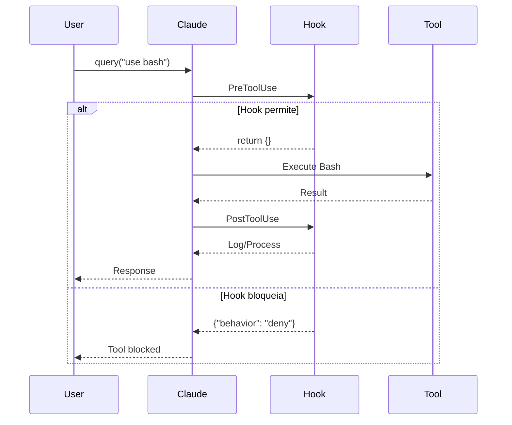
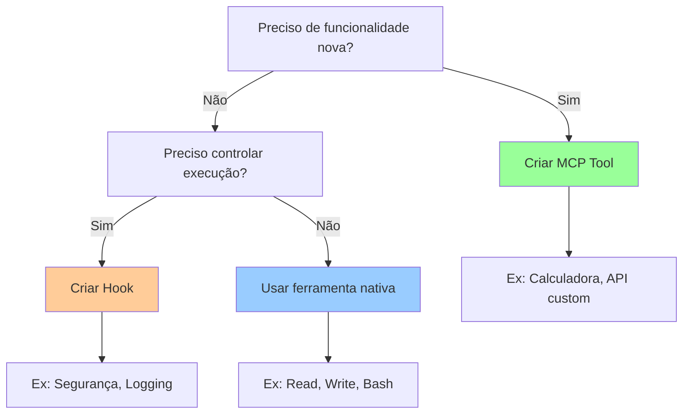
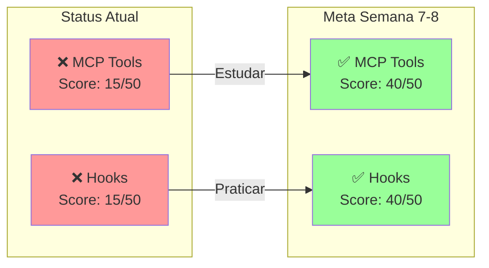

# 🔧 Sistema MCP Tools e Hooks

## Visão Geral
Como criar ferramentas customizadas (MCP) e controlar execução (Hooks).

## 🎯 MCP Tools - Arquitetura

```mermaid
graph TB
    subgraph "Criação de MCP Tool"
        Decorator[@tool decorator]
        Name[name: string]
        Desc[description: string]
        Schema[input_schema: dict]
        Func[async function]
    end

    subgraph "Execução"
        Input[Recebe args: dict]
        Process[Processa dados]
        Return[Retorna content dict]
    end

    subgraph "Estrutura de Retorno"
        Content["{'content': [...]}"]
        Type["{'type': 'text'}"]
        Text["{'text': 'resultado'}"]
    end

    Decorator --> Name
    Name --> Desc
    Desc --> Schema
    Schema --> Func

    Func --> Input
    Input --> Process
    Process --> Return

    Return --> Content
    Content --> Type
    Type --> Text

    style Decorator fill:#fc9
    style Return fill:#9f9
    style Content fill:#9cf
```

## 🪝 Hooks System - Fluxo



## 📝 Exemplo MCP Tool Completo

```python
from claude_code_sdk import tool

@tool(
    name="calculator",
    description="Calcula operações matemáticas",
    input_schema={
        "operation": str,  # "add", "subtract", etc
        "a": float,
        "b": float
    }
)
async def calculator_tool(args: dict) -> dict:
    """MCP Tool customizada para cálculos"""

    op = args["operation"]
    a = args["a"]
    b = args["b"]

    if op == "add":
        result = a + b
        symbol = "+"
    elif op == "subtract":
        result = a - b
        symbol = "-"
    elif op == "multiply":
        result = a * b
        symbol = "×"
    elif op == "divide":
        if b == 0:
            return {
                "content": [{
                    "type": "text",
                    "text": "Erro: divisão por zero"
                }],
                "is_error": True
            }
        result = a / b
        symbol = "÷"
    else:
        return {
            "content": [{
                "type": "text",
                "text": f"Operação '{op}' não suportada"
            }],
            "is_error": True
        }

    # SEMPRE retornar neste formato!
    return {
        "content": [{
            "type": "text",
            "text": f"{a} {symbol} {b} = {result}"
        }]
    }
```

## 🔒 Exemplo Hook Completo

```python
from claude_code_sdk import ClaudeCodeOptions
from claude_code_sdk.types import HookMatcher

async def security_hook(input_data, tool_id, context):
    """Hook de segurança para validar comandos"""

    tool_name = input_data.get("tool_name")

    # Verificar comandos Bash perigosos
    if tool_name == "Bash":
        command = input_data.get("tool_input", {}).get("command", "")

        # Lista de comandos bloqueados
        dangerous = ["rm -rf", "sudo", "chmod 777", "curl | sh"]

        for danger in dangerous:
            if danger in command:
                return {
                    "behavior": "deny",
                    "message": f"Comando bloqueado: {danger}"
                }

    # Verificar escrita em diretórios protegidos
    if tool_name in ["Write", "Edit"]:
        path = input_data.get("tool_input", {}).get("file_path", "")

        protected = ["/etc", "/usr", "/System"]

        for protected_dir in protected:
            if path.startswith(protected_dir):
                return {
                    "behavior": "deny",
                    "message": f"Diretório protegido: {protected_dir}"
                }

    # Permitir execução
    return {}

# Usar o Hook
options = ClaudeCodeOptions(
    hooks=[
        HookMatcher("PreToolUse", security_hook)
    ]
)
```

## 🎯 Decisão: MCP vs Hook



## 📊 Gaps do Diego



## 🚀 Roadmap de Aprendizado

### Semana 7: MCP Tools
1. **Dia 1**: Entender estrutura @tool
2. **Dia 2**: Criar primeira tool simples
3. **Dia 3**: Tool com validação de erros
4. **Dia 4**: Tool com schema complexo
5. **Dia 5**: Integrar com API externa

### Semana 8: Hooks
1. **Dia 1**: Entender PreToolUse
2. **Dia 2**: Criar hook de logging
3. **Dia 3**: Hook de segurança
4. **Dia 4**: PostToolUse para analytics
5. **Dia 5**: Sistema completo com múltiplos hooks

---

*Gap Crítico: Focar em MCP e Hooks nas semanas 7-8 para subir score!*