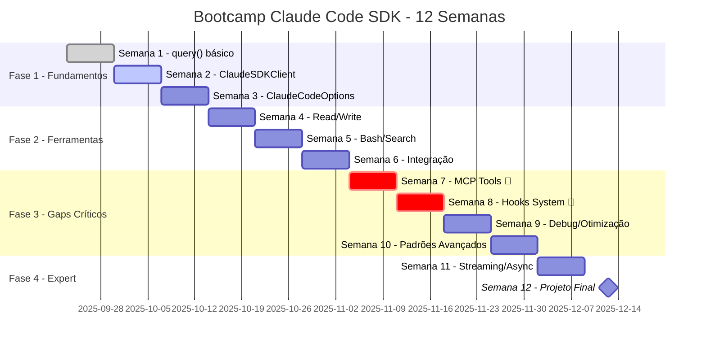
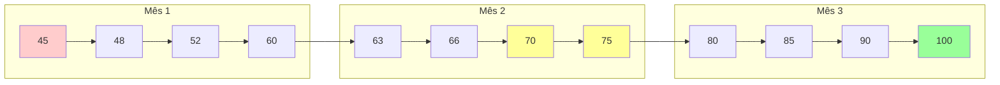
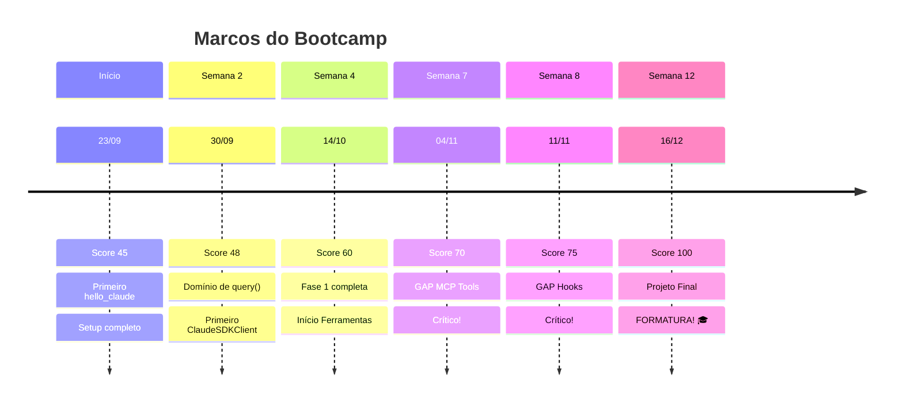
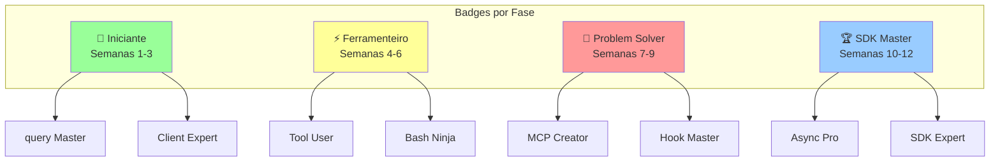
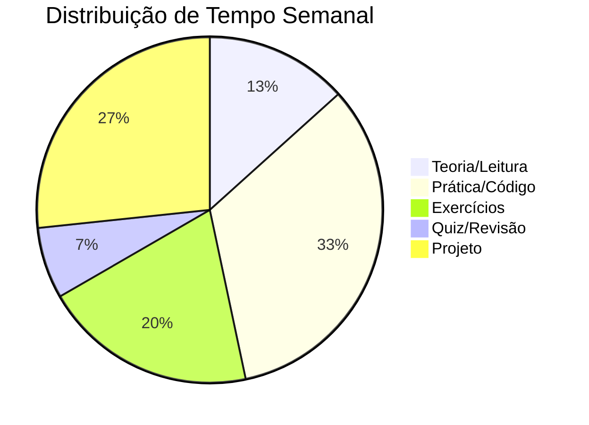
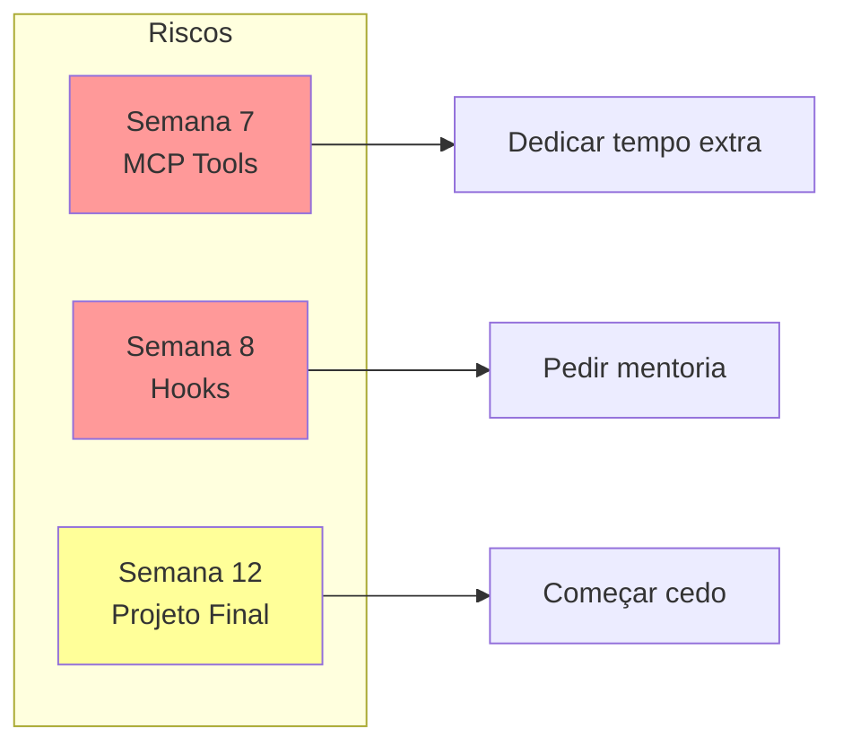

# 📅 Timeline Visual do Bootcamp - Diego Fornalha

## Jornada de 12 Semanas: Score 45 → 100

## Timeline Completa

## 📊 Evolução do Score

## 🎯 Marcos Importantes

## 📈 Detalhamento Semanal

### 🟢 Fase 1: Fundamentos (Score 45→60)

| Semana | Data | Foco | Entregável | Score |
|--------|------|------|------------|-------|
| 1 | 23-29 Set | query() e async | 3 exercícios básicos | 45→48 |
| 2 | 30 Set-06 Out | ClaudeSDKClient | Chat simples | 48→52 |
| 3 | 07-13 Out | ClaudeCodeOptions | Configurações | 52→60 |

### 🟡 Fase 2: Ferramentas (Score 60→70)

| Semana | Data | Foco | Entregável | Score |
|--------|------|------|------------|-------|
| 4 | 14-20 Out | Read/Write/Edit | Editor de texto | 60→63 |
| 5 | 21-27 Out | Bash/Grep/Search | CLI tool | 63→66 |
| 6 | 28 Out-03 Nov | Integração | Projeto integrado | 66→70 |

### 🔴 Fase 3: Gaps Críticos (Score 70→85)

| Semana | Data | Foco | Entregável | Score |
|--------|------|------|------------|-------|
| 7 | 04-10 Nov | **MCP Tools** 🚨 | Tool customizada | 70→75 |
| 8 | 11-17 Nov | **Hooks** 🚨 | Sistema segurança | 75→80 |
| 9 | 18-24 Nov | Debug/Otimização | Performance | 80→85 |

### 🏆 Fase 4: Expert (Score 85→100)

| Semana | Data | Foco | Entregável | Score |
|--------|------|------|------------|-------|
| 10 | 25 Nov-01 Dez | Padrões | Best practices | 85→90 |
| 11 | 02-08 Dez | Streaming | Real-time app | 90→95 |
| 12 | 09-16 Dez | **Projeto Final** | App completo | 95→100 |

## 🎮 Gamificação - Conquistas por Semana

## 📊 Carga Horária Sugerida

**Total**: 15 horas/semana (2-3h/dia útil)

## 🚨 Pontos de Atenção

## ✅ Checklist Semanal

### Esta Semana (Semana 1)
- [x] Setup ambiente
- [x] Primeiro programa
- [x] Entender query vs Client
- [ ] 3 exercícios práticos
- [ ] Quiz semanal

### Próxima Semana (Semana 2)
- [ ] Estudar ClaudeSDKClient
- [ ] Implementar chat
- [ ] 5 exercícios
- [ ] Projeto mini-chat
- [ ] Score 48+

---

*"12 semanas para dominar o SDK. Você está na semana 1. Keep going!" 🚀*