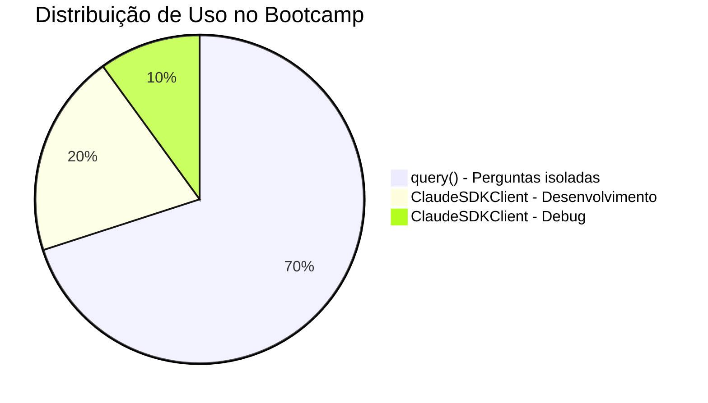

# 🌳 Árvore de Decisão - Query vs ClaudeSDKClient

## Quando usar cada abordagem?

## Árvore de Decisão Visual

```mermaid
graph TD
    Start[Preciso conversar com Claude?]

    Start --> Q1{A tarefa é isolada?}

    Q1 -->|Sim| Q2{Resposta única?}
    Q1 -->|Não| Client1[Use ClaudeSDKClient]

    Q2 -->|Sim| Query1[Use query\(\)]
    Q2 -->|Não| Q3{Precisa contexto anterior?}

    Q3 -->|Não| Query2[Use query\(\)]
    Q3 -->|Sim| Client2[Use ClaudeSDKClient]

    Query1 --> Ex1[Ex: Traduzir texto]
    Query2 --> Ex2[Ex: Análise de código]
    Client1 --> Ex3[Ex: Debug iterativo]
    Client2 --> Ex4[Ex: Desenvolvimento progressivo]

    style Query1 fill:#9cf,stroke:#333,stroke-width:2px
    style Query2 fill:#9cf,stroke:#333,stroke-width:2px
    style Client1 fill:#9f9,stroke:#333,stroke-width:2px
    style Client2 fill:#9f9,stroke:#333,stroke-width:2px
    style Start fill:#ffd,stroke:#333,stroke-width:3px
```

## 📊 Matriz de Decisão

| Critério | query() | ClaudeSDKClient |
|----------|---------|-----------------|
| **Memória de contexto** | ❌ Não | ✅ Sim |
| **Velocidade inicial** | ✅ Mais rápido | ⚠️ Setup inicial |
| **Uso de recursos** | ✅ Menor | ⚠️ Mantém sessão |
| **Complexidade do código** | ✅ Simples | ⚠️ Mais código |
| **Ideal para** | Tarefas únicas | Conversas longas |

## 🎯 Exemplos Práticos

### ✅ Use query() para:

```python
# 1. Pergunta simples
async for msg in query("O que é Python?"):
    print(msg)

# 2. Tradução
async for msg in query("Traduza 'hello' para português"):
    print(msg)

# 3. Análise única
async for msg in query("Revise este código: [código]"):
    print(msg)

# 4. Geração de conteúdo
async for msg in query("Crie um README para meu projeto"):
    print(msg)
```

### ✅ Use ClaudeSDKClient para:

```python
# 1. Debug iterativo
client = ClaudeSDKClient()
await client.query("Este código tem erro: [código]")
# ... recebe sugestão
await client.query("Tentei mas agora dá outro erro")
# ... Claude lembra do código anterior

# 2. Desenvolvimento progressivo
client = ClaudeSDKClient()
await client.query("Crie uma função de ordenação")
# ... recebe código
await client.query("Agora adicione validação")
# ... modifica código existente

# 3. Tutoriais/Aprendizado
client = ClaudeSDKClient()
await client.query("Explique recursão")
# ... explicação
await client.query("Mostre um exemplo")
# ... exemplo baseado na explicação

# 4. Pair Programming
client = ClaudeSDKClient()
await client.query("Vamos criar um CLI tool")
# ... desenvolvimento iterativo
```

## 🔄 Fluxograma de Perguntas

```mermaid
flowchart TD
    Q1[Vou fazer mais de uma pergunta?]
    Q1 -->|Não| UseQuery[query\(\)]
    Q1 -->|Sim| Q2[As perguntas são relacionadas?]

    Q2 -->|Não| UseQuery2[query\(\)]
    Q2 -->|Sim| Q3[Preciso que lembre das anteriores?]

    Q3 -->|Não| UseQuery3[query\(\)]
    Q3 -->|Sim| UseClient[ClaudeSDKClient]

    UseQuery --> Code1["async for msg in query(...)"]
    UseQuery2 --> Code1
    UseQuery3 --> Code1
    UseClient --> Code2["client = ClaudeSDKClient()\nawait client.query(...)"]

    style UseQuery fill:#9cf
    style UseQuery2 fill:#9cf
    style UseQuery3 fill:#9cf
    style UseClient fill:#9f9
```

## 📈 Estatísticas de Uso (Bootcamp)



## 💡 Regra de Ouro

> **"Na dúvida, comece com query()"**
>
> É mais simples e atende 80% dos casos. Só mude para Client quando realmente precisar de contexto.

## 🎮 Quiz Rápido

| Situação | Sua escolha? |
|----------|--------------|
| "Explique o que é API REST" | `query()` ✅ |
| "Vamos debugar este erro passo a passo" | `ClaudeSDKClient` ✅ |
| "Gere 5 nomes para meu projeto" | `query()` ✅ |
| "Crie um app e vamos melhorando" | `ClaudeSDKClient` ✅ |
| "Qual a capital do Brasil?" | `query()` ✅ |
| "Ensine-me Python progressivamente" | `ClaudeSDKClient` ✅ |

## 🚀 Sua Progressão

- **Semana 1**: Domine query() primeiro
- **Semana 2**: Aprenda ClaudeSDKClient
- **Semana 3**: Saiba escolher automaticamente

---

*Dica: 90% das suas tarefas usarão query(). Master isso primeiro!*