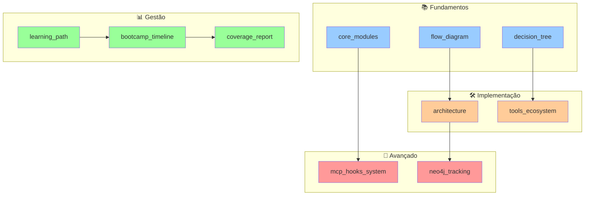

# 📊 Claude Code SDK - Diagramas Completos

## 🗺️ Índice de Diagramas

Este diretório contém **TODOS** os diagramas arquiteturais e de aprendizado do Claude Code SDK.

### 📚 Diagramas Disponíveis

| # | Arquivo | Descrição | Tipo | Para quem? |
|---|---------|-----------|------|------------|
| 1 | [01_core_modules.md](01_core_modules.md) | Estrutura dos módulos principais do SDK | Arquitetura | Desenvolvedores |
| 2 | [02_learning_path.md](02_learning_path.md) | Jornada de aprendizado de 12 semanas | Educacional | Estudantes |
| 3 | [03_architecture.md](03_architecture.md) | Arquitetura completa do sistema | Técnico | Arquitetos |
| 4 | [04_neo4j_tracking.md](04_neo4j_tracking.md) | Sistema de tracking com Neo4j | Integração | DevOps |
| 5 | [flow_diagram.md](flow_diagram.md) | Fluxo de execução query vs Client | Conceitual | Iniciantes |
| 6 | [sdk_coverage_report.md](sdk_coverage_report.md) | Relatório de cobertura 81.25% | Métricas | Gestores |
| 7 | [05_tools_ecosystem.md](05_tools_ecosystem.md) | Ecossistema de ferramentas nativas | Ferramentas | Usuários |
| 8 | [06_mcp_hooks_system.md](06_mcp_hooks_system.md) | Sistema MCP Tools e Hooks | Avançado | Experts |
| 9 | [07_bootcamp_timeline.md](07_bootcamp_timeline.md) | Timeline visual do bootcamp | Planejamento | Diego |
| 10 | [08_decision_tree.md](08_decision_tree.md) | Árvore de decisão query vs Client | Decisão | Todos |

## 🎯 Como Usar os Diagramas

### Para Iniciantes (Diego - Score 45)
1. Comece com: `flow_diagram.md` - Entenda o fluxo básico
2. Depois: `02_learning_path.md` - Veja sua jornada
3. Então: `08_decision_tree.md` - Quando usar o quê

### Para Desenvolvedores
1. Core: `01_core_modules.md` - Estrutura interna
2. Arquitetura: `03_architecture.md` - Visão completa
3. Ferramentas: `05_tools_ecosystem.md` - O que está disponível

### Para Experts
1. MCP/Hooks: `06_mcp_hooks_system.md` - Sistema avançado
2. Neo4j: `04_neo4j_tracking.md` - Tracking inteligente
3. Coverage: `sdk_coverage_report.md` - Métricas detalhadas

## 📈 Diagramas por Fase do Bootcamp

### 🟢 Fase 1: Fundamentos (Semanas 1-3)
- `flow_diagram.md` - Entender fluxo
- `08_decision_tree.md` - Tomar decisões
- `01_core_modules.md` - Conhecer estrutura

### 🟡 Fase 2: Ferramentas (Semanas 4-6)
- `05_tools_ecosystem.md` - Todas as ferramentas
- `03_architecture.md` - Como se conectam

### 🔴 Fase 3: Gaps (Semanas 7-10)
- `06_mcp_hooks_system.md` - MCP Tools e Hooks detalhados

### 🏆 Fase 4: Avançado (Semanas 11-12)
- `04_neo4j_tracking.md` - Sistema completo
- `sdk_coverage_report.md` - Domínio total

## 🚀 Visualização Rápida

### Diagrama Mestre - Visão 360°

## 📝 Legenda dos Diagramas

### Tipos de Diagrama
- **📐 Arquitetura**: Estrutura técnica do sistema
- **📚 Educacional**: Para aprendizado e ensino
- **🔄 Fluxo**: Mostra processos e decisões
- **📊 Métricas**: Dados e estatísticas
- **🗺️ Roadmap**: Planejamento e timeline

### Níveis de Complexidade
- **🟢 Básico**: Para iniciantes (Score < 60)
- **🟡 Intermediário**: Para usuários (Score 60-75)
- **🔴 Avançado**: Para experts (Score > 75)

## 🔍 Diagrama Específico para Cada Dúvida

| Sua Dúvida | Diagrama para Consultar |
|------------|-------------------------|
| "Quando usar query vs Client?" | `08_decision_tree.md` |
| "Como funciona o SDK?" | `01_core_modules.md` |
| "Quais ferramentas posso usar?" | `05_tools_ecosystem.md` |
| "Como criar MCP Tools?" | `06_mcp_hooks_system.md` |
| "Como está meu progresso?" | `02_learning_path.md` |
| "Como o Neo4j rastreia?" | `04_neo4j_tracking.md` |

## 🎨 Como Gerar Visualizações

Todos os diagramas usam Mermaid. Para visualizar:

1. **VSCode**: Instale extensão "Markdown Preview Mermaid Support"
2. **Online**: Cole em [mermaid.live](https://mermaid.live)
3. **GitHub**: Renderiza automaticamente

## 📌 Atualizações

- **Última atualização**: 23/09/2025
- **Cobertura SDK**: 81.25%
- **Total de diagramas**: 10
- **Novos diagramas planejados**: 0

---

*"Um diagrama vale mais que mil linhas de código"*

**Mantenha estes diagramas sempre à mão durante o bootcamp!** 🚀