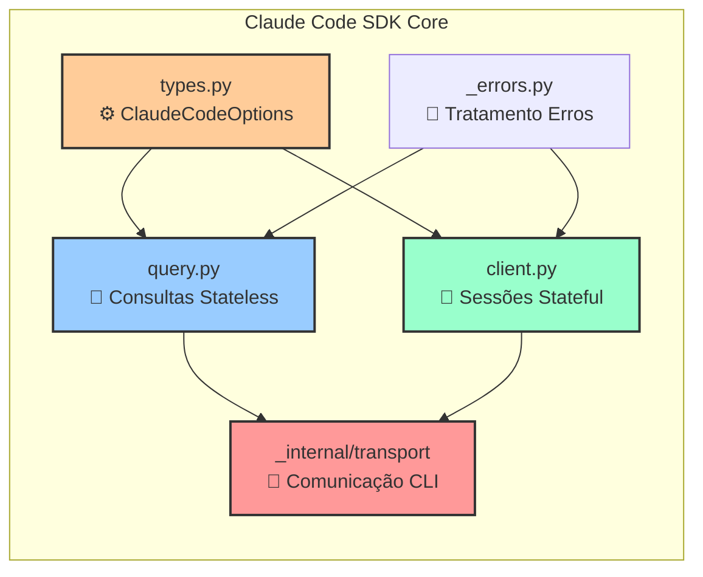
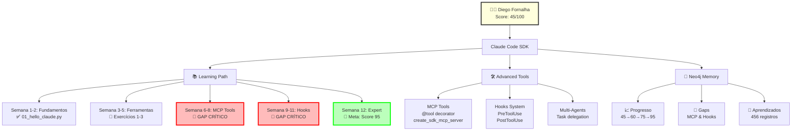
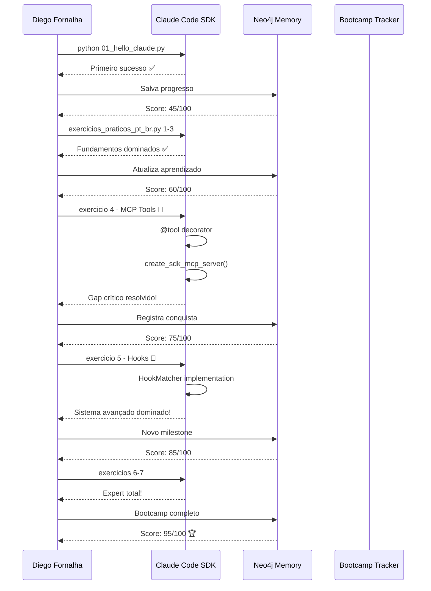

# Arquitetura Claude Code SDK - Bootcamp Diego Fornalha

## 📦 Core Modules - Estrutura Principal do SDK



## 🗺️ Fluxo de Aprendizado - Diego Fornalha



## Status Atual do Projeto

### 📊 Progresso Diego Fornalha
- **Score Atual**: 45/100
- **Meta**: 95/100 em 12 semanas
- **Semana**: 1 (Fundamentos)
- **Último Comando**: `/ai-basics` ✅

### ✅ Arquivos Criados
```
claude-code-sdk-python/
├── examples/
│   ├── 01_hello_claude.py              # Primeiro programa ✅
│   ├── exercicios_praticos.py          # Original em inglês
│   └── exercicios_praticos_pt_br.py    # Tradução PT-BR ✅
├── src/claude_code_sdk/
│   ├── query.py                        # Função principal
│   ├── client.py                       # Cliente interativo
│   ├── types.py                        # Configurações
│   └── *_pt-br.py                      # Traduções
└── COMECE_AQUI.md                      # Guia inicial ✅
```




## Comandos Essenciais

### Início Rápido
```bash
# Dia 1 - Hello World
python examples/01_hello_claude.py

# Ver todos exercícios
python examples/exercicios_praticos_pt_br.py

# Exercício específico
python examples/exercicios_praticos_pt_br.py 4

# Check-in diário
/daily-progress
```

### Neo4j Memory - Aprendizados Salvos
- ✅ Estrutura SDK documentada (ID: 428)
- ✅ Módulos principais mapeados (ID: 441)
- ✅ Conceitos básicos dominados (ID: 427)
- ✅ Gaps críticos identificados (IDs: 417, 419)
- ✅ Framework universal criado (ID: 456)

## Próximos Passos Imediatos

1. **AGORA**: `python examples/01_hello_claude.py`
2. **HOJE**: Exercícios 1-2 (query e configurações)
3. **SEMANA**: Exercícios 3-4 (pipeline e MCP Tools)
4. **CRÍTICO**: Dominar exercício 4 (MCP) e 5 (Hooks)

---

*Branch atual: feature/portuguese-translations*
*Criador: Diego Fornalha (diegofornalha@gmail.com)*