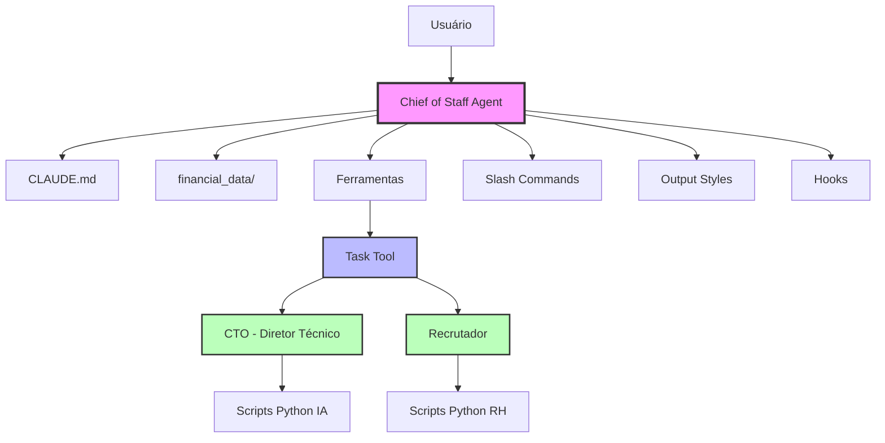
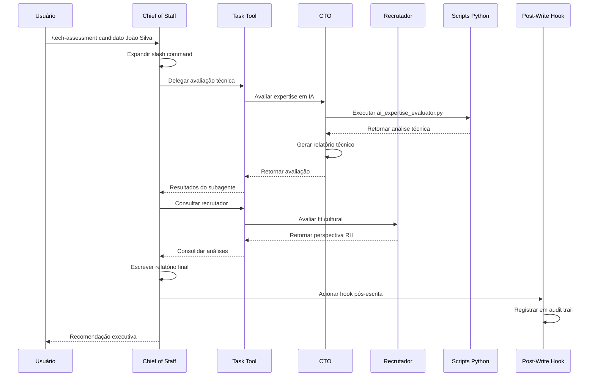

# Arquitetura do Agente Chief of Staff

```mermaid
graph TD
    User[Usuário] --> Chief[Chief of Staff Agent]
    Chief --> Memory[CLAUDE.md]
    Chief --> FinData[financial_data/]
    Chief --> Tools[Ferramentas]
    Chief --> Commands[Slash Commands]
    Chief --> Styles[Output Styles]
    Chief --> Hooks[Hooks]

    Tools --> Task[Task Tool]
    Task --> CTO[CTO - Diretor Técnico]
    Task --> Recruiter[Recrutador]

    CTO --> Scripts1[Scripts Python IA]
    Recruiter --> Scripts2[Scripts Python RH]

    style Chief fill:#f9f,stroke:#333,stroke-width:3px
    style Task fill:#bbf,stroke:#333,stroke-width:2px
    style CTO fill:#bfb,stroke:#333,stroke-width:2px
    style Recruiter fill:#bfb,stroke:#333,stroke-width:2px
```

## Fluxo de Comunicação Esperado entre Agentes

```mermaid
sequenceDiagram
    participant User as Usuário
    participant Chief as Chief of Staff
    participant Task as Task Tool
    participant CTO as CTO
    participant Recruiter as Recrutador
    participant Scripts as Scripts Python
    participant Hooks as Post-Write Hook
    User->>Chief: /tech-assessment candidato João Silva
    Chief->>Chief: Expandir slash command
    Chief->>Task: Delegar avaliação técnica
    Task->>CTO: Avaliar expertise em IA
    CTO->>Scripts: Executar ai_expertise_evaluator.py
    Scripts-->>CTO: Retornar análise técnica
    CTO->>CTO: Gerar relatório técnico
    CTO-->>Task: Retornar avaliação
    Task-->>Chief: Resultados do subagente
    Chief->>Task: Consultar recrutador
    Task->>Recruiter: Avaliar fit cultural
    Recruiter-->>Task: Retornar perspectiva RH
    Task-->>Chief: Consolidar análises
    Chief->>Chief: Escrever relatório final
    Chief->>Hooks: Acionar hook pós-escrita
    Hooks->>Hooks: Registrar em audit trail
    Chief-->>User: Recomendação executiva
```
